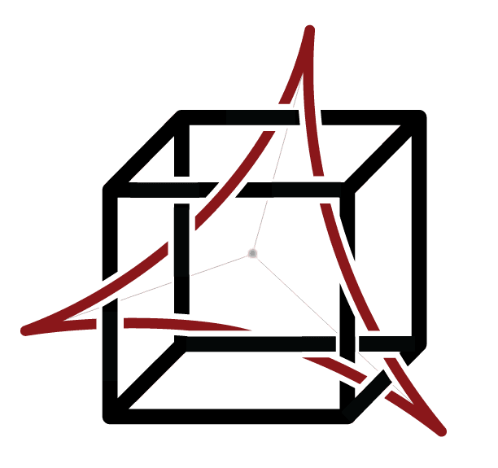

<p align="center">

</p>

[](https://github.com/peznauts/swift-octahe/blob/master/LICENSE)
[](https://twitter.com/intent/follow?screen_name=peznaut)

# Octahe

Configure targets using OCI compatible files.

## Why

This application is being created to better enable teams to deploy application into more robust
targets, without the constraints of a container. Given the proliferation of containers it is safe
to assume most of the core logic that enables the worlds applications resides within
**Containerfile**(s). While containers are generally fantastic tools, they can be limiting, they
can create application complexities, and they do create bottlenecks. octahe aims to enable teams to
deploy applications into stateful targets, with **Containerfile**(s), without any of the
containerization machinery.

### Configuration

The Octahe initiative follows the [Dockerfile](https://docs.docker.com/engine/reference/builder)
reference with one new verb, `TO`.

#### TO

``` dockerfile
TO [--escalate=<path-to-binary>, --name=<string>, --via=<string>] <address>:<port>@<user>
```

The `TO` instruction initializes a new connection to a given target for subsequent instructions.
As such, a valid file must start with a `TO` instruction.

ARG is the only instruction that may precede `TO` in the file. See
[Understand how ARG and FROM interact](https://docs.docker.com/engine/reference/builder/#understand-how-arg-and-from-interact).

`TO` can appear multiple times within a single file to create multiple connections to different targets.

Every `TO` entry requires three parts `<address>:<port>@<user>`. The address can be an IP
address or FQDN. The port will always be an integer. The user should be the username required
to access the given target.

The optional `--escalate` flag can be used to specify the means of privledge escallation. This
option requires the binary needed to perform a privledge escallation. Privledge escallation
may require a password, if this is the case, provide the password via the CLI by including
the `--escalate-pw` flag. Any password provided will only exist during runtime as an ARG.

``` dockerfile
ARG  USER=access-user
FROM image-name:tag-id
TO   --escalate=/usr/bin/sudo 127.0.0.1:22@${USER}
RUN  dnf install -y curl
```

The optional `--name` flag can be used to specify a friendly "name" of a given node. If a name is
not provided, the system will assign the given target a "name" using a SHA1.

``` dockerfile
ARG  USER=access-user
FROM image-name:tag-id
TO   --escalate=/usr/bin/sudo --name=bastion0 127.0.0.1:22@${USER}
RUN  dnf install -y curl
```

The optional `--via` flag can be used to specify the "bastion" used to transport the connection.
This provides the means to proxy a connection through another node into an environment. The syntax
for the `--via` optional argument follows the same mechanics as the `TO` verb; the `--via` argument
can accept the "name" of a given host.

> Because `--via` can take complete connection details, it is possible for a target to proxy commands
  through a node not being deployed to.

``` dockerfile
ARG  USER=access-user
FROM image-name:tag-id
TO   --escalate=/usr/bin/sudo --name=bastion0 127.0.0.1:22@${USER}  # First node named "bastion0"
TO   --escalate=/usr/bin/sudo --via=127.0.0.1:22@${USER} --name=bastion1 127.0.0.2:22@${USER}  # Connection via the first target using the connection details.
TO   --escalate=/usr/bin/sudo --via=bastion1 127.0.0.3:22@${USER}  # Connection via the second target using the name.
RUN  dnf install -y curl
```

#### FROM

The **FROM** instruction will pull a container image, inspect the layers, and derive all compatible verbs which are then inserted into the execution process.

#### ENTRYPOINT

The `ENTRYPOINT` verb will create a **oneshot** systemd service on the target. This will
result in the entrypoint commanded running on system start. All systemd `oneshot` services
will be placed in `/etc/systemd/system/octahe/`. Where they will be enabled but not started
upon creation.

> To ensure that the generated `ENTRYPOINT` service file is unique, a SHA1 of the
  `ENTRYPOINT` value will be generated as the service file name.

#### CMD

This verb is treated in the same way as `ENTRYPOINT`, but will start the service file upon
creation.

#### HEALTHCHECK

The `HEALTHCHECK` verb will create a watchdog service for a given `ENTRYPOINT` service file.
This will convert the **oneshot** service to a **notify** service.

The following arguments are supported when a `HEALTHCHECK` is instantiated.

* --interval=30s
* --timeout=30s
* --retries=3

``` dockerfile
...
HEALTHCHECK --interval=5m --timeout=3s --retries=3 CMD curl -f http://localhost/ || exit 1
```

#### STOPSIGNAL

The `STOPSIGNAL` verb will create a `KillSignal` entry for a given `ENTRYPOINT` systemd
service.

``` dockerfile
...
STOPSIGNAL 99
```

#### EXPOSE

The `EXPOSE` verb will create an IPTables rule for a given port and/or service mapping.
IP tables rules will be added into the **octahe** chain.

``` dockerfile
...
EXPOSE 80/tcp
EXPOSE 8080:80/udp
```

### Ignored Verbs

Because the following options have no effect on a stateful targets, they're ignored.

* ONBUILD
* VOLUME

### Executing a deployment

The following section covers CLI and output examples.

##### Standard Example

``` shell
octahe deploy ~/Targetfile
```

``` console
Step 0/4 : FROM image-name:tag-id
 ---> done
Step 1/4 : ARG USER=access-user
 ---> done
Step 2/4 : TO [("10.0.0.1:22@root")]
 ---> done
Step 3/4 : RUN dnf update && dnf add install && rm -r /var/cache/  # Inserted into deployment FROM inspected image,
 ---> done
Step 4/4 : RUN  dnf install -y curl
 ---> done
Successfully deployed.
```

##### Optional Example

By default all targets listed in the `TO` verb will connect and execute the steps serially.
This can be changed by modifying the connection quota. If the quota is less than the total
number of targets, connections will be grouped by the given quota.

``` shell
octahe deploy --connection-quota=3 ~/Targetfile
```

``` console
Step 0/4 : FROM image-name:tag-id
 ---> done
Step 1/4 : ARG USER=access-user
 ---> done
Step 2/4 : TO [("bastion0", "bastion1", "127.0.0.3:22@access-user")]
 ---> done
Step 3/4 : RUN dnf update && dnf add install && rm -r /var/cache/  # Inserted into deployment FROM inspected image,
 ---> done
Step 4/4 : RUN  dnf install -y curl
 ---> done
Successfully deployed.
```

##### Failure Example

In the event of an execution failure, the failed targets will be taken out of the execution steps.

``` shell
octahe deploy ~/Targetfile
```

``` console
Step 0/4 : FROM image-name:tag-id
 ---> done
Step 1/4 : ARG USER=access-user
 ---> done
Step 2/4 : TO [("bastion0"), ("bastion1"), ("127.0.0.3:22@access-user")]
 ---> done
Step 3/4 : RUN dnf update && dnf add install && rm -r /var/cache/  # Inserted into deployment FROM inspected image,
 ---> degraded
Step 4/4 : RUN  dnf install -y curl
 ---> degraded
Deployed complete, but degraded.
Degrated hosts:
[-] bastion1 - failed "Step 3/4"
[-] 127.0.0.3:22@access-user - failed "Step 4/4"
```

##### Manual target Example

To rerun a failed execution on only the failed targets specify the targets on the CLI using the
`--targets` flag.

``` shell
octahe deploy --connection-quota=3 --targets="--name node1 10.0.0.4:22@root" --targets="--via node1 10.0.0.6:22@root" --targets="10.0.0.8:22@root" ~/Targetfile
```

``` console
Step 0/4 : FROM image-name:tag-id
 ---> done
Step 1/4 : ARG USER=access-user
 ---> done
Step 2/4 : TO [("10.0.0.4:22@root", "10.0.0.6:22@root", "10.0.0.8:22@root")]
 ---> done
Step 3/4 : RUN dnf update && dnf add install && rm -r /var/cache/  # Inserted into deployment FROM inspected image,
 ---> done
Step 4/4 : RUN  dnf install -y curl
 ---> done
Successfully deployed.
```

##### Multi-file Example

A deployment can be executed with more than one file allowing multiple files to be concatenated together.
Each file provided will have the contents of the file inserted into the deployment.

``` shell
octahe deploy ~/Containerfile ~/Targetfile
```

``` console
Step 0/4 : FROM image-name:tag-id
 ---> done
Step 1/4 : ARG USER=access-user
 ---> done
Step 2/4 : TO [("bastion0"), ("bastion1"), ("127.0.0.3:22@access-user")]
 ---> done
Step 3/4 : RUN dnf update && dnf add install && rm -r /var/cache/  # Inserted into deployment FROM inspected image,
 ---> done
Step 4/4 : RUN  dnf install -y curl
 ---> done
Successfully deployed.
```

### Executing an undeployment

The following section covers CLI and output examples for a deployment and undeployment.

##### Deployment Configuration File

``` dockerfile
ARG  USER=access-user
FROM image-name:tag-id
TO   --escalate=/usr/bin/sudo 127.0.0.1:22@${USER}
ENTRYPOINT ["top", "-b"]
```

##### Deployment Execution

``` shell
octahe deploy ~/Targetfile
```

``` console
Step 0/4 : FROM image-name:tag-id
 ---> done
Step 1/4 : ARG USER=access-user
 ---> done
Step 2/4 : TO [("10.0.0.1:22@root")]
 ---> done
Step 3/4 : RUN dnf update && dnf add install && rm -r /var/cache/  # Inserted into deployment FROM inspected image,
 ---> done
Step 4/4 : ENTRYPOINT 0a25e5f88885e1564daab76f1bbcc8ffc38b9d29 created
 ---> done
Successfully deployed.
```

##### Undeployment Execution

``` shell
octahe undeploy ~/Targetfile
```

``` console
Step 0/1 : TO [("10.0.0.1:22@root")]
 ---> done
Step 1/1 : ENTRYPOINT 0a25e5f88885e1564daab76f1bbcc8ffc38b9d29 removed
 ---> done
Successfully undeployed.
```
